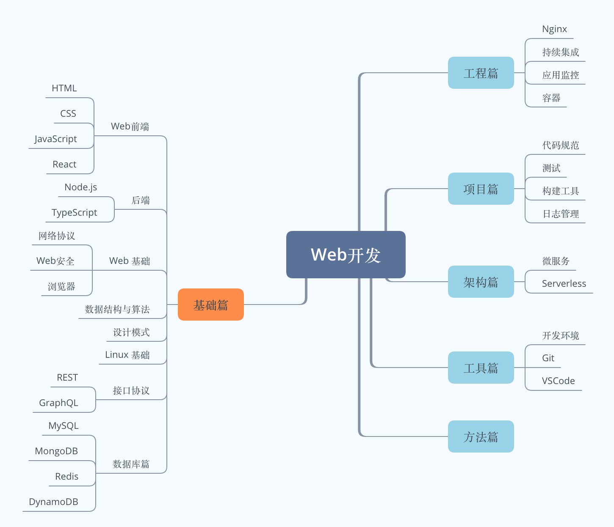

# Node 小栈

大家好，我叫**莫林**，目前从事一些 Web 相关的开发工作。[Node 小栈](http://blog.gezhiqiang.com)是我用来记录一些平时学习总结的博客。博客整体尽量按照技术体系来归类，慢慢构建一个属于我的知识架构。文章尽量做到追本溯源，从原理上来梳理每一个知识点。  
个人水平有限，且难免有疏漏。如果文章中有错误，或对某些内容存有疑惑，请大家提 [issue](https://github.com/gedennis/blog/issues) 指正。

## 知识图谱

以下是我根据自己工作需求制定的图谱，不一定适合每个人。分类不一定合理，要划分准确确实是一件麻烦的事，仅供参考。

<!-- TOC -->

## 目录

- [基础篇](#基础篇)
  - [Web 前端](#web-前端)
    - [HTML](#html)
    - [CSS](#css)
    - [JavaScript](#javascript)
    - [React](#react)
  - [后端](#后端)
    - [Node.js](#nodejs)
    - [TypeScript](#typescript)
  - [Web 基础](#web-基础)
    - [网络协议](#网络协议)
    - [Web 安全](#web-安全)
    - [浏览器](#浏览器)
  - [数据结构与算法](#数据结构与算法)
  - [设计模式](#设计模式)
  - [Linux 基础](#linux-基础)
  - [接口协议](#接口协议)
    - [REST](#rest)
    - [GraphQL](#graphql)
  - [数据库篇](#数据库篇)
    - [MySQL](#mysql)
    - [MongoDB](#mongodb)
    - [Redis](#redis)
    - [DynamoDB](#dynamodb)
- [工程篇](#工程篇)
  - [Nginx](#nginx)
  - [持续集成](#持续集成)
  - [应用监控](#应用监控)
  - [容器](#容器)
- [项目篇](#项目篇)
  - [代码规范](#代码规范)
  - [测试](#测试)
  - [构建工具](#构建工具)
  - [日志管理](#日志管理)
- [架构篇](#架构篇)
  - [微服务](#微服务)
  - [Serverless](#serverless)
- [工具篇](#工具篇)

  - [开发环境](#开发环境)
  - [Git](#git)
  - [VSCode](#vscode)

- [Android](#Android)

- [方法篇](#方法篇)

<!-- /TOC -->

## 基础篇

### Web 前端

#### HTML

#### CSS

#### JavaScript

#### React

### 后端

#### Node.js

- [2017-07-26 发布属于自己的 npm 模板](./node/20170726-publish-npm-module.md)
  

#### TypeScript

### Web 基础

#### 网络协议

#### Web 安全

#### 浏览器

### 数据结构与算法

### 设计模式

### Linux 基础

### 接口协议

#### REST

#### GraphQL

### 数据库篇

#### MySQL

#### MongoDB

#### Redis

#### DynamoDB

## 工程篇

### Nginx

### 持续集成/部署

- [2019-04-28 Terraform 实践初探](./cd/20190428-terraform-usage.md)

### 应用监控

### 容器

- [2017-02-22 Dockerfile 配置小结](./docker/20170222-dockerfile-intro.md)
- [2017-02-04 利用 Minikube 来部署一个 nodejs 应用](./docker/20170204-minikube-deploy-nodejs-app.md)
  

## 项目篇

### 代码规范

- [2019-04-17 使用 ESLint 和 Prettier 规范代码](./project/20190417-build-eslint-prettier.md)

- [2019-04-18 使用 TSLint 和 Prettier 规范 TypeScript 项目](./project/20190418-build-tslint-prettier.md)
  

### 测试

### 构建工具

### 日志管理

## 架构篇

### 微服务

### Serverless

**AWS**

- [2019-04-19 AWS 常用服务简介](./serverless/20190419-aws-intro.md)
- [2019-04-20 AWS 命令行界面 (AWS CLI) 使用小结](./serverless/20190420-aws-cli-intro.md)
- [2019-04-21 AWS IAM 实践总结](./serverless/20190421-aws-iam-summary.md)

**Serverless**

- [2019-04-22 Serverless 实践初探](./serverless/20190422-serverless-intro.md)

## 工具篇

### 开发环境

- [2019-04-15 打造高效的 Mac 开发环境](./tools/20190415-setup-mac-dev-env.md)

### Git

### VSCode

- [2019-04-16 设置一个适合自己的 VSCode 环境](./tools/20190416-setup-own-vscode.md)

## Android

- [2019-05-02 使用 Android Studio 构建应用程序](./android/20190502-android-studio-build-app.md)

## 方法篇

- [2019-01-09 MAS 学习法](./approach/20190109-mas-method.md)
