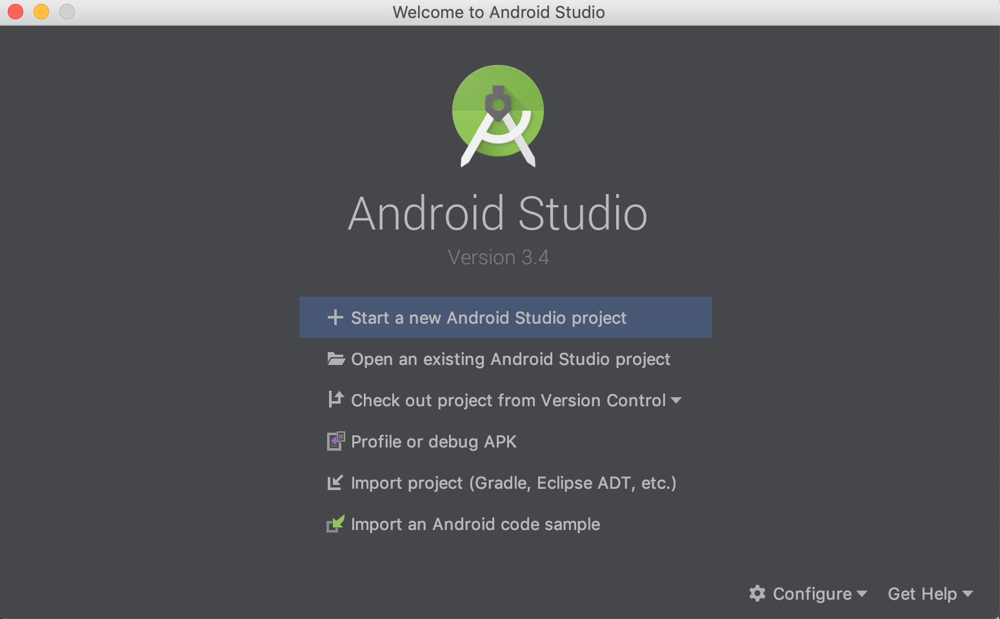
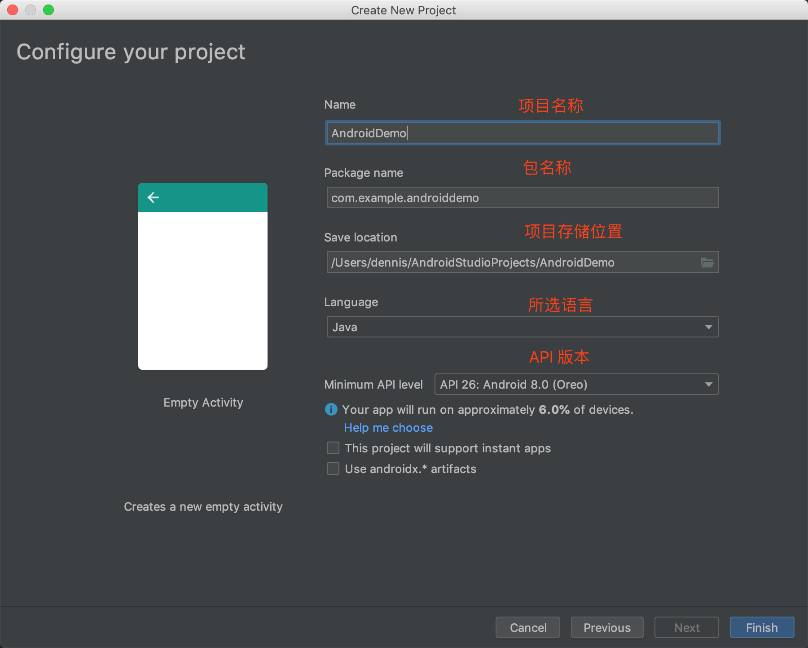
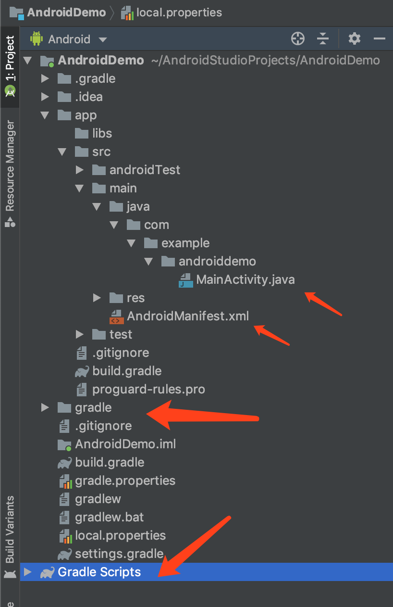

## 使用 Android Studio 构建应用程序

Android 提供了一个内容丰富的应用框架，支持使用 Java 语言为移动设备开发 Android 应用。Android 应用都是将各种可单独调用的组件加以组合开发而成。例如，提供应用界面的单个 Activity，以及在后台独立运行的 Service。也可以使用 Itent 来从一个组件启动另一个组件。同时 Android 提供一个自适应框架，为不同的设配配置不同的资源，例如针对不同屏幕尺寸创建不同的 XML 布局文件等。Android SDK 工具会将代码，连同任何数据和资源文件，打包到一个 `.apk` 的存档文件中。这个 APK 文件包含 Android 应用的所有内容，可以安装到 Android 系统设备上。关于更多 Android 的基础知识，请查看[官网文档](https://developer.android.com/guide/components/fundamentals)。
本文将简单介绍，如何使用 Android Studio 来开发一个简单的应用程序。

### 安装配置 Android Studio

[Android Studio](https://developer.android.com/studio/intro) 是基于 IntelliJ IDEA 的官方 Android 应用开发环境 (IDE)。Android Studio 是代码编辑器和开发工具外，还提供很多提高 Android 应用构建效率的功能。

- 基于 Gradle 的灵活构建系统
- 功能丰富的模拟器 (emulator)
- C++ 和 NDK 支持

#### 安装

Android Studio 的安装非常简单，到[下载页](https://developer.android.com/studio/install)下载自己相应系统版本的安装文件安装即可。对于 MacOS 系统，下载 dmg 文件，将其拖到 Applications 文件夹，即可启动 Android Studio。第一次启动，需要安装 Android SDK 并指定安装位置，这个路径很重要，后面需要多次用到。默认安装位置：

```
$HOME/Library/Android/sdk
```

选好安装路径，点击安装相应的工具组件。这些组件包含很多要用的工具，例如 ADB、Emulator 和 NDK 等等。可以在 【首选项】-【系统配置】- 【Android SDK】中，下载更多的工具和 SDK 版本。例如要安装我们接下来需要的 NDK，我们需要勾选安装 `NDK`、`LLDB` 和 `CMake`。  
安装完成之后，我们暂时还不能使用 adb 等指令，还需要`配置 PATH`。在 `.zshrc`文件中加入以下语句。

```
export ANDROID_SDK=/Users/dennis/Library/Android/sdk
export ANDROID_NDK=/Users/dennis/Library/Android/sdk/ndk-bundle
export PATH=$ANDROID_SDK/emulator:$ANDROID_SDK/tools/bin:$ANDROID_SDK/tools:$ANDROID_SDK/platform-tools:$ANDROID_NDK:$PATH
```

注意：这里 emulator 必须放在 tools 之前，不然之后使用 emulator 指令会出现路径问题。

#### 配置

Android Studio 有各种配置项，这里就不多深究。这里我们修改以下主题，以及把按键改成 Vim 模式。

- 修改主题 【首选项】- 【Editor】- 【Color Scheme】，选择 `Darcula`。
- vim 按键 【首选项】- 【Plugins】- 搜索安装 【IdeaVim】。

官网提供了更多的配置项说明，请查看[这里](https://developer.android.com/studio/intro/studio-config)。

### 创建应用

在 `Welcome to Android Studio` 窗口中，点击 `Start a new Android Studio project`。



在【choose your project】窗口，选择 【Empty Activity】，下一步。
在【configure your project】窗口，填入相应的 `项目名称`、`项目路径`、`语言`、以及 `API 版本`等信息，完成创建。



创建完之后，项目的结构如下：


Android 视图下可以看到以下几个重要的文件：

```
├── AndroidDemo.iml
├── app #Android App目录
├── ├── build #构建输出目录
│   ├── build.gradle #构建脚本
│   ├── libs #so相关库
│   ├── proguard-rules.pro #proguard混淆配置
│   └── src #源代码，资源等
├── build.gradle #工程构建文件
├── gradle
│   └── wrapper
├── gradle.properties #gradle的配置
├── gradlew #gradle wrapper linux shell脚本
├── gradlew.bat
├── local.properties #配置Androod SDK位置文件
└── settings.gradle #工程配置
```

**MainActivity.java**
应用入口，主 Activity，位于 `app > src > main > java > com.example.androiddemo > MainActivity.java`。
**AndroidManifest.xml**  
[AndroidManifest.xml](https://developer.android.com/guide/topics/manifest/manifest-intro.html) 文件描述应用的基本特性并定义其每个组件。 位于`app > src > main` 文件夹。
**activity_main.xml**  
此 XML 文件会定义 Activity 界面的布局。位于`app > src > main` 文件夹。
**build.gradle**  
`build.gradle` 文件用来配置 Gradle 工具编译和构建应用的方式。

### 配置构建

Android 构建系统编译应用资源和源代码，然后将它们打包成可供测试、部署、签署和分发的 APK。Android Studio 使用 [Gradle](https://gradle.org/) 这一高级构建工具包来自动执行和管理构建流程，同时也允许您定义灵活的自定义构建配置。  
Gradle 是一个基于 Ant 和 Maven 概念的项目自动化建构工具。它使用一种基于 Groovy 的特定领域语言 (DSL) 来声明项目设置。  
关于更多构建的配置，请查看官网[配置构建页](https://developer.android.com/studio/build/index.html)，或者查看[这篇文章](https://www.flysnow.org/2015/03/30/manage-your-android-project-with-gradle.html)。

### 运行程序

Android Studio 支持在`物理机`和`模拟器`上运行程序。具体查看[这里](https://developer.android.com/studio/run)。我们现在介绍一下从[模拟器](https://developer.android.com/studio/run/emulator)启动。模拟器使用 Android Virtual Device (AVD) 配置确定被模拟设备的外观、功能和系统映像。要创建和管理 AVD，请使用 [AVD Manager](https://developer.android.com/studio/run/managing-avds)。

- 通过点击 Tools > AVD Manager 打开 AVD Manager。
- 点击位于 AVD Manager 对话框底部的 Create Virtual Device。
  出现 Select Hardware 页面。
- 选择硬件配置，然后点击 Next。出现 System Image 页面。
- 选择针对特定 API 级别的系统映像，然后点击 Next。
  > 注意这里最好选没有 Google Play 的版本，这样就不用自己去 root 了。
- 下载安装，一直默认设置，可以取一个名字，完成创建。

### 卸载 Android Studio

如果要在 Mac 下完全卸载 Android Studio, 可以在 terminal 执行以下指令。

```
rm -Rf /Applications/Android\ Studio.app
rm -Rf ~/Library/Preferences/AndroidStudio*
rm -Rf ~/Library/Preferences/com.google.android.*
rm -Rf ~/Library/Preferences/com.android.*
rm -Rf ~/Library/Application\ Support/AndroidStudio*
rm -Rf ~/Library/Logs/AndroidStudio*
rm -Rf ~/Library/Caches/AndroidStudio*
rm -Rf ~/.AndroidStudio*
rm -Rf ~/AndroidStudioProjects
rm -Rf ~/.gradle
rm -Rf ~/.android
rm -Rf ~/Library/Android*
```

这种方式比较干净。当然也可以选择安装 [app cleaner](https://nektony.com/mac-app-cleaner/download?productname=Android%20Studio) 来卸载应用。更多卸载方法，参看[这里](https://nektony.com/mac-app-cleaner/download?productname=Android%20Studio)。

### 参考

[1][使用gradle管理你的android studio工程](https://www.flysnow.org/2015/03/30/manage-your-android-project-with-gradle.html)
