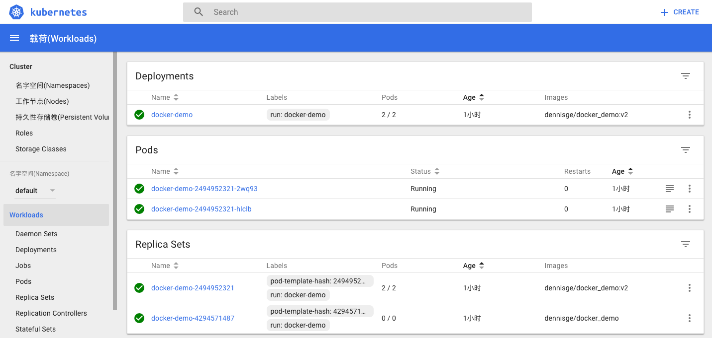

<!-- TOC -->

- [搭建 kubernetes 环境](#搭建-kubernetes-环境)
  - [安装 Minikube](#安装-minikube)
  - [安装 vm](#安装-vm)
  - [安装 kubectl](#安装-kubectl)
  - [启动 Minikube](#启动-minikube)
- [部署应用](#部署应用)
- [基本概念和指令](#基本概念和指令)
- [发布应用](#发布应用)
- [扩容和更新](#扩容和更新)
- [kubenetes dashboard](#kubenetes-dashboard)
- [总结](#总结)
- [参考](#参考)

<!-- /TOC -->

Kubernetes 是 docker 容器编排系统, 用于协调高可用的计算机集群，并在这个集群上以更有效的方式自动分发和调度应用程序。由于 kubernetes 本地安装比较复杂，所以社区推出了[Minikube](https://github.com/kubernetes/minikube)。Minikube 是在本地的虚拟机中运行一个单节点的 kubernetes 集群。
本文将会介绍 Minikube 的安装，在 kubernetes 集群上部署一个应用，并且简单扩容以及通过 rolling update 更新镜像。最后会简单介绍一下 kubernetes dashboard 的简单使用。

<a id="markdown-搭建-kubernetes-环境" name="搭建-kubernetes-环境"></a>

## 搭建 kubernetes 环境

<a id="markdown-安装-minikube" name="安装-minikube"></a>

### 安装 Minikube

Minikube 可以安装在 linux、mac 和 windows 上。我们只介绍在 mac 以及 ubuntu 14.04 上的安装。更多关于安装 Minikube 请参考[官方教程](https://kubernetes.io/docs/tasks/tools/install-minikube/)。
Minikube 是使用 go 开发生成的二进制文件，下载并放到`/usr/local/bin`即可。

```sh
// linux 下安装
curl -Lo minikube https://storage.googleapis.com/minikube/releases/latest/minikube-linux-amd64 && chmod +x minikube && sudo mv minikube /usr/local/bin/
// mac
brew cask install minikube //可能不是最新
// 也可以下面的方式
curl -Lo minikube https://storage.googleapis.com/minikube/releases/v0.21.0/minikube-darwin-amd64 && chmod +x minikube && sudo mv minikube /usr/local/bin/
```

验证安装成功。

```
$ minikube version
minikube version: v0.21.0
```

<a id="markdown-安装-vm" name="安装-vm"></a>

### 安装 vm

因为 Minikube 是在 host 上启动一个 VM 来运行 Kubernetes 集群的，所以还要安装一个 VM。
下面介绍 mac 下安装`xhyve`和 linux 下安装`virtual box`。更多关于 vm 的安装，请参考下面的[安装指导](https://github.com/kubernetes/minikube#requirements)。

```
// linux virtualbox
sudo apt-get install virtualbox

// macos xhyxhyve
brew install docker-machine-driver-xhyve
sudo chown root:wheel $(brew --prefix)/opt/docker-machine-driver-xhyve/bin/docker-machine-driver-xhyve
sudo chmod u+s $(brew --prefix)/opt/docker-machine-driver-xhyve/bin/docker-machine-driver-xhyve
```

<a id="markdown-安装-kubectl" name="安装-kubectl"></a>

### 安装 kubectl

Kubectl 是 kubernetes 的命令行工具，用来 管理部署在 kubernetes 上的应用。可以根据自己的操作系统，按照[官网教程](https://kubernetes.io/docs/tasks/tools/install-kubectl/)安装 kubectl。

```
// 1. 下载
// linux
$ curl -LO https://storage.googleapis.com/kubernetes-release/release/$(curl -s https://storage.googleapis.com/kubernetes-release/release/stable.txt)/bin/linux/amd64/kubectl
// mac
$ curl -LO https://storage.googleapis.com/kubernetes-release/release/$(curl -s https://storage.googleapis.com/kubernetes-release/release/stable.txt)/bin/darwin/amd64/kubectl
或者
$ brew install kubectl

// 2. 更改执行权限 并移到指定位置。
$ chmod +x ./kubectl
$ sudo mv ./kubectl /usr/local/bin/kubectl
```

验证 kubectl 是否安装成功。

```
$ kubectl version
Client Version: version.Info{Major:"1", Minor:"7", GitVersion:"v1.7.0", GitCommit:"d3ada0119e776222f11ec7945e6d860061339aad", GitTreeState:"clean", BuildDate:"2017-06-29T23:15:59Z", GoVersion:"go1.8.3", Compiler:"gc", Platform:"linux/amd64"}
Server Version: version.Info{Major:"1", Minor:"7", GitVersion:"v1.7.0", GitCommit:"d3ada0119e776222f11ec7945e6d860061339aad", GitTreeState:"clean", BuildDate:"2017-07-26T00:12:31Z", GoVersion:"go1.8.3", Compiler:"gc", Platform:"linux/amd64"}
```

这里有可能会出现下面的错误状况。

```
Client Version: version.Info{Major:"1", Minor:"7", GitVersion:"v1.7.2", GitCommit:"922a86cfcd65915a9b2f69f3f193b8907d741d9c", GitTreeState:"clean", BuildDate:"2017-07-21T19:06:19Z", GoVersion:"go1.8.3", Compiler:"gc", Platform:"darwin/amd64"}
The connection to the server localhost:8080 was refused - did you specify the right host or port?
```

这里只有客户端的信息，没有服务端的信息，那是因为我们的 Minikube 还没有启动，下面我们就启动 Minikube。

<a id="markdown-启动-minikube" name="启动-minikube"></a>

### 启动 Minikube

安装上面的工具之后，就可以通过`minikube start`来启动。

```
$ minikube start
Starting local Kubernetes v1.7.0 cluster...
Starting VM...
Getting VM IP address...
Moving files into cluster...
Setting up certs...
Starting cluster components...
Connecting to cluster...
Setting up kubeconfig...
Kubectl is now configured to use the cluster.
```

也可以通过`--vm-driver`指定虚拟机启动。

```
minikube start --vm-driver xhyve
```

这样 minikube 就启动了。可以通过`kubectl cluster-info`查看集群的信息。

```
$ kubectl cluster-info
Kubernetes master is running at https://192.168.99.100:8443
```

可以看到一个运行的 master。
也可以通过`kubectl get nodes`查看运行的 node（目前只有一个）。

```
$kubectl get nodes
NAME       STATUS    AGE       VERSION
minikube   Ready     13m       v1.7.0
```

这里还要介绍个概念就是`context`。context 决定 kubectl 与哪个 cluster 交互。可以在`~/.kube/config`中查看。通过以下指令指定 context。

```
kubectl config use-context minikube
```

默认就是 minikube。

<a id="markdown-部署应用" name="部署应用"></a>

## 部署应用

启动 kubernetes cluster 之后，就可以部署应用到集群上。部署一个应用需要创建一个`Deployment`。Deployment 负责创建和更新应用程序实例。创建 Deployment 之后，kubernetes master 会将创建的应用程序调度到各个 node 上。
创建应用实例后，kubernetes deploymentController 会监视这些实例，如果某个节点不可用或者删除，会自动替换实例。  
创建部署时，通常需要指定应用程序的`镜像`和`副本数`。以下部署一个简单的 node 应用。

```
const express = require('express');
const http = require('http');

const app = express();

app.get('/', (req, res) => {
  return res.send({ success: true, msg: 'hello kubernetes'});
});

http.createServer(app).listen(1226, () => {
  console.log('Server is listening on port 1226');
});
```

这个镜像我 push 到了[docker hub](https://hub.docker.com/r/dennisge/docker_demo/)。

> 这里因为刚开始试的时候，Minikube 里一直拉取不了镜像。正确的方式应该是搭建一个 private docker registry。但折腾中还有点不明白之处，所以这里先不做具体介绍，直接 push 到 docker hub。后续会介绍更多关于 docker registry 的搭建，到时候顺便再一起解释。

也可以使用 minikube VM 的 docker 来拉镜像。

```sh
$ eval $(minikube docker-env)
```

如果不需要使用 minikube 的 docker，可以再恢复。

```sh
$ eval $(minikube docker-env -u)
```

使用`kubectl run` 创建一个部署。

```sh
$ kubectl run docker-demo --image=docker_demo --port=1226
```

image 指定镜像，port 指定端口。这里要注意的是，启动的容器名`docker-demo`,只能是小写字母、数字和加 - 横线。
这样我们就部署了一个应用到 node 上。通过`kubectl get deployments`查看。

```
$ kubectl get deployments
NAME          DESIRED   CURRENT   UP-TO-DATE   AVAILABLE   AGE
docker-demo   1         1         1            0           22s
```

如果 pods 一直处于`ContainerCreating`阶段，可能还是还不能拉取镜像。

可以通过`minikube ssh`进入 vm，然后拉取对应镜像。

```
$ minikube ssh
$ docker pull dennisge/docker_demo
```

这时，可以看到我们的 pod 的状态是`running`。到此，我们就成功部署了我们的应用。

<a id="markdown-基本概念和指令" name="基本概念和指令"></a>

## 基本概念和指令

Kubernetes 集群由两种类型的资源组成：`master` 和 `Nodes`。 master 是集群的调度节点，nodes 则是应用程序实际运行的工作节点。类似于 nginx 的 master 和 worker。  
部署应用时需要创建`deployment`。每个 deployment 会根据指定的`副本数`，创建相应的`pod`来托管我们的应用实例。Pod 可以理解为应用实例特定的逻辑主机，表示一个或多个容器组和这些容器的共享资源，包共用卷、唯一的集群 IP 和容器运行的信息，如端口等。
而`Node`是 kubernetes 的工作机器（物理机或虚拟机）。Node 由 master 管理，可以在一个 node 上部署多个 pod。每个 node 至少需要两种组件，`kubelet` 和 `容器运行时（docker）`。kubelet 是负责 master 和所有节点间的通信进程，管理机器上运行的 pod 和容器。容器运行时负责从 registry 拉取镜像，解包镜像并运行应用实例。  
kubectl 有一系列指令管理实例的运行情况。

```
// 查看deployment
kubectl get deployments
// 删除deployment，会自动删除相应pods
kubectl delete deployment <部署名>


// 查看pods
// 查看当前namespace下的pods
kubectl get pods
// 查看所有pods
kubectl get pods --all-namespaces
// 查看pods的具体信息
kubectl describe pod <pod name>
//特定namespace下的，需要指定namespace
kubectl describe pod <pod name> --namespace=kube-system

// 查看pod日志
kubectl logs pod <pod name>
// 进入pod
kubectl exec -it <pod name> bash
```

<a id="markdown-发布应用" name="发布应用"></a>

## 发布应用

通过上面部署的应用，在主机外访问不了（可以通过 kubectl proxy 的方式访问）。还要需要将其发布为`service`。 service 是一组相同逻辑的 pods 和一个访问它们的策略。一组 pods 通常由`label选择器`确定。可以在 ServiceSpec 中指定类型以不同的方式暴露服务。

- Cluster IP(默认)： 只有集群内部访问。
- NodePort: 使用 NAT 方式，在集群中每个选定的节点的同一端口上暴露服务。可以在集群外部访问服务。
- LoadBalancer：创建外部负载均衡。
- ExternalName：使用任意名称显示服务。

可以通过`kubectl expose`命令来发布服务。

```sh
$ kubectl expose deployment/<deployment name> --type=NodePort --port 1226
```

这样就 expose 了一个服务，就可以外部访问了。可以通过一下指令得到 url。

```sh
$ minikube service <service name> --url
http://192.168.64.2:32354

$ curl http://192.168.64.2:32354
{"success":true,"msg":"hello kubernetes"}
```

<a id="markdown-扩容和更新" name="扩容和更新"></a>

## 扩容和更新

根据线上需求，扩容和缩容是常会遇到的问题。`Scaling` 是通过更改 Deployment 中的副本数量实现的。一旦您有应用程序的多个实例，您将能够滚动更新，而不会停止服务。通过`kubectl scale`指令来扩容和缩容。

```
// 扩充到3个实例
kubectl scale deployments/docker-demo --replicas=3
// 缩小到1个实例
kubectl scale deployments/docker-demo --replicas=1
```

我们都是期望应用 24/7 运行，但又需要频繁部署。这我们就需要`rolling update(滚动更新)`。 Rolling updates 允许通过使用新的 Pods 实例逐个更新来实现零停机的部署更新。新的 Pods 会被调度到可用资源的 Node 节点上。可以通过`set image`修改镜像。

```
$ kubectl set image deployments/<部署名> <部署名>=镜像名：tag
```

如我们的第二版镜像。

```
kubectl set image deployments/docker-demo docker-demo=dennisge/docker_demo:v2
```

重新设置镜像之后，就会执行滚动更新。

以上我们就成功部署了自己的应用。但是都是通过指令来进行的，下面我们将介绍一下部署 kubernetes dashboard，并通过 web ui 的方式部署、删除和修改相关应用等。

<a id="markdown-kubenetes-dashboard" name="kubenetes-dashboard"></a>

## kubenetes dashboard

[Kubernetes dashboard](https://kubernetes.io/docs/tasks/access-application-cluster/web-ui-dashboard/)是一个基于 web UI 的用户接口，可以再界面上完成上面的部署应用、扩容缩容和滚动更新等一系列操作，也可以查看 cluster 的运行情况。  
如果没 GFW 的原因，minikube 会下载和部署一些组件的，运行在 kube-system namespace 下。可以查看镜像看看这些组件。

```
$ docker images
REPOSITORY                                             TAG                 IMAGE ID            CREATED             SIZE

gcr.io/google_containers/k8s-dns-kube-dns-amd64        1.14.4              a8e00546bcf3        5 weeks ago         49.4MB
gcr.io/google_containers/k8s-dns-dnsmasq-nanny-amd64   1.14.4              f7f45b9cb733        5 weeks ago         41.4MB
gcr.io/google-containers/kube-addon-manager            v6.4-beta.2         0a951668696f        7 weeks ago         79.2MB
gcr.io/google_containers/kubernetes-dashboard-amd64    v1.6.1              71dfe833ce74        2 months ago        134MB
gcr.io/google_containers/pause-amd64                   3.0                 99e59f495ffa        15 months ago       747kB
```

安装好之后，就可以通过以下指令获得 dashboard 的访问地址。

```
$ minikube dashboard --url
```

这样就可以访问 dashboard，并进行相关的操作。
但这里通常会遇到 dashboard 和 kube-addon-manager 出现`ImagePullBackOff`的情况。这个问题就是我们无法拉取 google 的镜像。可以参考这个[方法](http://www.jianshu.com/p/a42eeb66a19c)来解决。  
这个方法主要是冒充原来的镜像。可以查看对应 deployment 的镜像，然后在别的地方如阿里镜像等拉取对应镜像，或者拉取镜像放到 docker hub。再登陆 Minikube，拉取该镜像，再重新 tag 为原 deployment 需要的镜像。
以 kube-addon-manager 为例。

```sh
$ minikube ssh
$ docker pull registry.cn-hangzhou.aliyuncs.com/google-containers/kube-addon-manager-amd64:v6.1
$ docker tag registry.cn-hangzhou.aliyuncs.com/google-containers/kube-addon-manager-amd64:v6.1 gcr.io/google-containers/kube-addon-manager:v6.1
```

这样就可以看到这些组件的状态变为 running。
这样的 dashboard 还是很朴素,如下图：



这就需要安装 [heapster](https://github.com/kubernetes/minikube/issues/873) 插件。可以查看现在的 addons 列表。

```
$ minikube addons list
- registry: disabled
- dashboard: enabled
- kube-dns: enabled
- heapster: disabled
- ingress: disabled
- addon-manager: enabled
- default-storageclass: enabled
- registry-creds: disabled
```

发现 heapster 是关闭的。可以把它开启。

```
$ minikube addons enable heapter
```

我们会看到已经部署了相关的 pod。

```
$ kubectl get pods --namespace=kube-system
NAME                          READY     STATUS             RESTARTS   AGE
heapster-jgzf2                1/1       Running            0          12h
influxdb-grafana-lqdtk        2/2       Running            0          12h
```

这通常会遇到 ImagePullBackOff 问题，无法拉取镜像。这里需要以下几个镜像。

```
gcr.io/google_containers/heapster_influxdb:v0.6
gcr.io/google_containers/heapster_grafana:v2.6.0-2
gcr.io/google_containers/heapster_influxdb:v0.6
```

可以安装上面介绍的镜像冒充的方法解决这个问题。我是在我的 aws 上下载相应镜像 push 到我的 docker hub。然后下载 docker hub 的镜像，再重命名需要的镜像。这样我们的 heapster 就正常运行了，可以看到漂亮的图表。
就可以愉快的使用 dashboard 了。


<a id="markdown-总结" name="总结"></a>

## 总结

Kubernetes 是 docker 的重要编排工具。我们通过 Minikube 来部署一个应用，来了解 kubernetes 的一些基本使用。  
本文介绍了在 mac 和 linux 的 Minikube 安装、kubectl 安装，以及基于 VM 来启动 minikube 集群。然后通过部署一个 node 应用，并成功地伸缩扩容并通过 rolling update 更新镜像。在这个过程中，我们也了解了 node、deployment、pod、service 等概念。最后我们介绍了一下 kubernetes dashboard 的安装、heapster 插件安装以及可能遇到的问题及解决方案。

<a id="markdown-参考" name="参考"></a>

## 参考

[1][kubernetes tutorial](https://kubernetes.io/docs/tutorials/kubernetes-basics/)  
[2][利用 minikube 运行 kubernetes](http://kubernetes.kansea.com/docs/getting-started-guides/minikube/)  
[3][driver plugin installation](https://github.com/kubernetes/minikube/blob/master/docs/drivers.md#xhyve-driver)  
[4][minikube github](https://github.com/kubernetes/minikube#requirements)  
[5][mac安装kubernetes并运行echoserver](http://www.jianshu.com/p/a42eeb66a19c)  
[6][heapster addon](https://github.com/kubernetes/minikube/issues/873)
