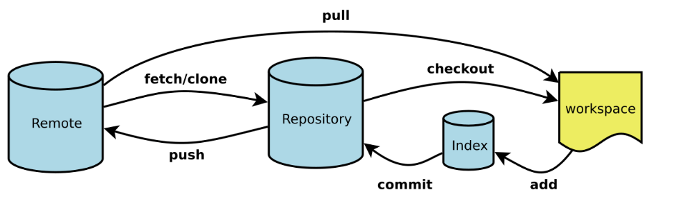
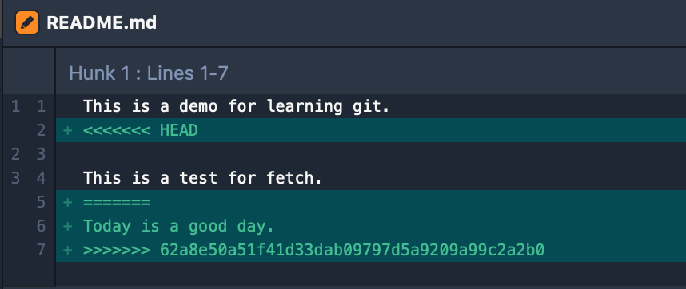

## 最浅显易懂的 Git 实践教程

对于软件开发，特别是团队开发来说，版本控制系统不可或缺。`版本控制系统 (Version Control System)` 可以非常方便的跟踪每一次的代码修改、版本管理，并且可以随时回退到某个提交。  
Git 是目前最流行的版本管理工具，由 Linux 创始人 Linus Torvalds 创建于 2005 年。虽然 Git 很常用，但很多开发人员还是没有完全用好。之前就经常遇到因团队成员错误的用法，导致出各种问题的情况。鉴于此，我于是决定整理出一份常用的实践指南，也便于后续查看。

## 安装配置

### 安装

Git 的安装非常简单。很多系统都默认安装了 Git。验证是否已经安装。

```
$ git --version
git version 2.15.1 (Apple Git-101)
```

没有安装的，自己安装。

```
// mac
$ brew install git
// linux
$ sudo apt-get update
$ sudo apt-get install git
```

如果喜欢用 GUI 的，可以选择使用 [SourceTree](https://www.sourcetreeapp.com/)。我个人喜欢命令行。

### 配置

初次使用，我们需要对 Git 环境做简单的配置。Git 的配置通常在两个文件：`$HOME/.gitconfig` 和 `项目目录下/.git/config`。后者的优先级更高。

- 配置用户信息

```
$ git config --global user.name "John Doe"
$ git config --global user.email johndoe@example.com
```

配置的用户信息会跟随每一次提交。对于特定项目想使用不同的用户名和邮箱，可以在项目目录下修改，不带 `--global`。

```
$ git config --global user.name "John Doe2"
$ git config --global user.email johndoe2@example.com
```

查看当前配置：

```
$ git config --list
```

更多的 Git 配置，请查看[这里](https://git-scm.com/book/zh/v1/%E8%87%AA%E5%AE%9A%E4%B9%89-Git-%E9%85%8D%E7%BD%AE-Git)。

### 生成 SSH 公钥

通常我们都需要配置 SSH 公钥来操作远程仓库。SSH 公钥位于 `$HOME/.ssh`文件夹下。

- id_dsa 私钥
- id_dsa.pub 公钥

如果没有，可以使用 `ssh-keygen` 指令来生成。

```
$ ssh-keygen -t rsa -b 4096 -C "你的邮箱"
```

关于更多 SSH 公钥生成的细节，请参考[这里](https://help.github.com/en/articles/connecting-to-github-with-ssh)。生成之后，将公钥复制到远程服务器，如 GitHub、GitLab 等。

## 基础概念

在实践操作之前，必须简单说一点概念，以便在后续的操作中，有一个整体的概念。Git 中有 4 个工作区域：
**本地仓库(Repository)**
本地仓库，又叫做 Git 目录。就是 `git clone` 下来目录下的 `.git`文件夹，如果是 `git clone --bare`，就是目录本身。Git 目录是用来存放元数据和对象数据库的地方。该目录非常重要，每次克隆仓库，实际就是拷贝的这个目录的数据。

**工作目录(workspace)**  
工作目录，其实就是从 Git 目录中取出某个版本的所有文件和目录，用来编辑修改。工作目录下的文件都是从 Git 目录中的压缩对象数据库中提取出来的。

**暂存区(Index/Stage)**
暂存区，其实就是一个文件，所以也可以叫索引文件。主要是用来存放文件的修改信息。

**远程仓库(Remote)**
远程仓库托管在远程服务器，可以用于团队不同成员版本管理。

四个工作区域的基本工作流如下图：


## 基础实践

基础实践，我们将使用 [BitBucket](https://bitbucket.org)，所以你需要创建一个 BitBucket 账户。你也可以使用 GitHub 或者 GitLab，因为最近团队使用 BitBucket，所以用 BitBucket 举例。另外，假设你已经按上面的步骤安装和配置好了 Git，并把 SSH 公钥复制到了 BitBucket。

### 创建一个 Git 仓库

有两种方式来创建 Git 仓库: `git clone` 和 `git init`。
**git clone**  
如果已经有一个远程仓库，可以直接 clone 到本地。我们可以到 BitBucket 创建一个仓库，得到一个仓库地址，然后 clone 到本地。

```
$ git clone git@bitbucket.org:<your name>/gitdemo.git <local name>
```

这时我们可以看到 gitdemo 目录下有一个 `.git`文件夹，这就是我们说的`本地仓库`。

```
$ ls -al
```

**git init**  
如果本地已经有代码目录，可以初始化 Git 目录。

```
$ git init
```

同样，我们可以在文件夹下，看到生成了一个 `.git` 目录。

### 管理修改

#### 查看当前状态

这里首先介绍我们第一个常用的命令 `git status`，查看当前的文件状态。

```
$ git status
On branch master
Your branch is up to date with 'origin/master'.

nothing to commit, working tree clean
```

我建议经常使用 git status 查看当前文件状态，特别在 merge、rebase 等场合。可以时刻跟踪状态，并根据提示执行操作。例如，当前状态是 clean 的，是我最喜欢看到的状态。

#### 文件修改

接下来，我们对仓库下的 README 文件进行修改。我们把 README 文件中的内容全部删掉，然后加一句话。

```
This is a demo for learning git.
```

修改保存之后，我们再 git status 查看状态：

```
$ git status
On branch master
Your branch is up to date with 'origin/master'.

Changes not staged for commit:
  (use "git add <file>..." to update what will be committed)
  (use "git checkout -- <file>..." to discard changes in working directory)

	modified:   README.md

no changes added to commit (use "git add" and/or "git commit -a")
```

这里我们看到文件 README 文件修改了，并且有几个提示。

- 可以使用 `git add <file>...` 提交(commit)更改。
- 可以使用 `git checkout -- <file>...` 取消更改。

如果觉得要对某些文件的更改撤销，可以使用 git checkout 撤销工作区的修改。

```
$ git checkout -- <file1> <file2>
```

或者直接全部撤销。

```
$ git checkout .
```

这里我们不撤销，继续下面的步骤。

#### 保存修改

我们使用 `git add` 来暂存修改，其实就是把工作目录的修改，保存到暂存区(文件)。
保存指定文件：

```
$ git add <file1> <file2>
```

要保存所有修改文件。

```
$ git add .
```

add 之后，我们再一次 git status。看到修改都从红色变成绿色的了，表示都暂存了。

#### 提交修改

到这一步，我们只是把修改放到了暂存区，还没有真正的保存到本地仓库。需要使用 `git commit` 提交 (commit)。

```
$ git commit
```

这个时候，会打开设置的编辑器，添加 commit 信息，就 commit 成功了。默认的编辑器是 vi, 也可以自己设置。

```
$ git config core.editor "vim"
```

当然，可以通过 `-m` 参数直接添加 commit 信息。

```
$ git commit -m "doc: update README"
```

我个人是不使用 `-m` 参数。这种方式虽然方便，但直接 `git commit` 可以再一次查看要提交的内容, 更放心。
提交完成之后，我们可以通过 `git log` 查看提交记录。

```
$ git log
```

#### 提交到远程仓库

现在，我们已经把我们修改的内容保存到本地仓库了。但是如何分享给其他 teammate 呢？我们就需要推送到`远程仓库`了。

**查看当前的远程服务器**

```
$ git remote
origin
```

也可以加 `-v` 参数，显示远程仓库名及相应的 URL。

```
$ git remote -v
origin	git@bitbucket.org:**/gitdemo.git (fetch)
origin	git@bitbucket.org:**/gitdemo.git (push)
```

clone 的仓库，Git 会默认取名 `origin`。

**添加远程仓库**

对于我们本地 git init 的仓库，此时还没有添加远程地址。可以通过以下指令添加：

```
$ git remote add <shortname> <url>
```

我们可以取任意名字，但通常是 origin。并且我们可以添加多个远程仓库的地址。例如，我们添加一个名为 `ml` 的远程仓库。

```
$ git remote add ml git@bitbucket.org:**/gitdemo.git
```

现在我们就有两个远程仓库了。

```
$ git remote
ml
origin
```

**修改远程仓库**

当然，我们也可以修改远程仓库的名字，或者删除远程仓库。

```
$ git remote rename ml ml2
$ git remote rm ml2
```

如果想修改远程仓库的地址，可以使用如下指令。

```
$ git remote set-url <name> <new url>
```

如果不指定名称，默认就是修改 origin。

**推送代码**
添加完远程仓库，就可以推送提交了。

```
$ git push [remote-name] [branch-name]
```

例如，我们将 master 分支推送的 origin 远程服务器。

```
$ git push origin master
```

对于本地创建的分支，第一次推送到远程服务器，需要加 `-u` 或者 `--set-upstream` 参数，跟踪远程分支。后面讲分支(branch)时，会再次讲到。

```
$ git push -u origin master
```

此时，我们就可以在 BitBucket 上看见我们的提交了。

上面讲的是 Git 使用最基本，也是最常见的场景。到目前为止，我们还没有产生过任何`冲突(conflict)`。而冲突经常出现在协作开发的场景。

## 协作开发

关于协作开发中的远程仓库操作，大体可以通过这张图有一个整体认识。


### 拉取代码

按照上面的步骤，我们顺利的 push 了一个 commit 到远程仓库。如果此时有一个 teammate 也推送了一个提交。我们可以在 BitBucket 上修改 README 文件来模拟这个操作。我们就需要把他的代码，拉取到本地。

```
$ git fetch <remote> <branch>
```

git fetch 会把远程仓库的更改，拉取到本地仓库，但并不会更新工作目录。

```
$ git fetch origin
$ git status
On branch master
Your branch is behind 'origin/master' by 1 commit, and can be fast-forwarded.
  (use "git pull" to update your local branch)

nothing to commit, working tree clean
```

这里我们看到我们工作目录的分支，比 origin/master 落后一个 commit，但可以 `fast-forwarded`。
此时我们如果工作目录修改了 README，并且提交之后，查看状态是这样的。

```
$git status
On branch master
Your branch and 'origin/master' have diverged,
and have 1 and 1 different commits each, respectively.
  (use "git pull" to merge the remote branch into yours)

nothing to commit, working tree clean
```

按照提示，git pull 代码

```
$ git pull origin master
```

出现冲突了。


解决冲突之后，保存并 commit 之后，增加一条新的 `merge commit`，可以 git log 查看。图示如下
<bitbucket 图>
我们在重复这个操作，在远程新增一个更改，本地修改之后再 commit。我们会这次执行 `git pull --rebase origin master`。

```
$ git status
rebase in progress; onto 16b2dbe
You are currently rebasing branch 'master' on '16b2dbe'.
  (fix conflicts and then run "git rebase --continue")
  (use "git rebase --skip" to skip this patch)
  (use "git rebase --abort" to check out the original branch)

Unmerged paths:
  (use "git reset HEAD <file>..." to unstage)
  (use "git add <file>..." to mark resolution)

	both modified:   README.md

no changes added to commit (use "git add" and/or "git commit -a")
```

这也是我们第一次接触 rebase，不要慌。首先注意的是，这里切换到了一个新的分支来处里 rebase, 而且这个临时分支是在 origin/master 基础上拉的，然后将工作目录的 master 分支的修改，应用到这个新分支。这很好，我们可以随时 `git rebase --abort` 回到原来的分支，可以有后悔的权利。继续用要解决冲突。如果要解决完冲突，继续 `git rebase --continue`。
我们继续解决冲突，并通过 `git add` 指令标记已解决冲突。然后接下来的动作很重要。这里千万不要 `git commit`。记得随时 git status 查看状态提示。

```
$ git status
rebase in progress; onto 16b2dbe
You are currently rebasing branch 'master' on '16b2dbe'.
  (all conflicts fixed: run "git rebase --continue")

nothing to commit, working tree clean
```

继续执行 `git rebase --continue`。完成 rebase 之后，我们又回到了 master 分支，这次我们 git log 在查看一下，发现没有生成 merge conflict 的 commit message 了。这样我们就可以非常清楚的看到分支的提交历史了。
注意：这里可能会遇到一种情况，就是在 rebase 的过程中，会逐个将 commit 应用到 origin/master 分支，如果某个 commit 的内容已经应用过了，就是出现这个错误。

```
$ git rebase --continue
Applying: local: test fetch
No changes - did you forget to use 'git add'?
If there is nothing left to stage, chances are that something else
already introduced the same changes; you might want to skip this patch.

Resolve all conflicts manually, mark them as resolved with
"git add/rm <conflicted_files>", then run "git rebase --continue".
You can instead skip this commit: run "git rebase --skip".
To abort and get back to the state before "git rebase", run "git rebase --abort".
```

参考[这里](http://wholemeal.co.nz/blog/2010/06/11/no-changes-did-you-forget-to-use-git-add/)。这种状况，其实是这个 patch 已经应用了，可是使用 `git rebase --skip` 删掉这个 commit。skip 这个操作千万要注意使用，因为它是永久删除。所以千万是这种情况才使用。

还有一种情况，当我们工作目录修改了很多文件，然而有一个紧急的小改动要提交。可以把现在工作目录的提交先暂存起来。修改完成提交之后，再把这些暂存的提交恢复出来。

```
$ git add . 先添加暂存区
$ git stash  暂存
$ git stash pop 将最新一个 stash 恢复
$ git stash list 查看 stash 列表
```

成功恢复之后，暂存的 stash 就会删除。此时如果恢复 stash 内容和现有工作目录内容有冲突，则和 rebase 原理一样。执行 rebase 的流程即可。执行完之后，此时暂存的 stash 并不会删除。可以手动删除。

```
$ git stash drop <stash id> // 删除指定 stash
$ git stash clear   // 删除全部
```

### 删除提交

- git reset
- git revert

### 打标签

https://git-scm.com/book/zh/v2/Git-%E5%9F%BA%E7%A1%80-%E6%89%93%E6%A0%87%E7%AD%BE

### 分支

- 新建分支

```
$ git branch <branch name>
```

只会创建，但不会自动切换过去。使用 `git checkout` 切换分支。

```
$ git checkout <branch name>
```

可以合并为一句：

```
$ git checkout -b <branch name>
```

- 合并分支
  merge
  rebase
- 删除分支

## git flow 工作流

## 总结

## 参考

[1][learn git with bitbucket cloud](https://www.atlassian.com/git/tutorials/learn-git-with-bitbucket-cloud)  
[2][git-tower: learn version control with git](https://www.git-tower.com/learn/git/ebook)
[3][git scm book](https://git-scm.com/book/en/v2)
[4][图解 git](https://marklodato.github.io/visual-git-guide/index-zh-cn.html)
[5][廖雪峰的 git 教程](https://www.liaoxuefeng.com/wiki/896043488029600)
[6][http://wholemeal.co.nz/blog/2010/06/11/no-changes-did-you-forget-to-use-git-add/](http://wholemeal.co.nz/blog/2010/06/11/no-changes-did-you-forget-to-use-git-add/)
